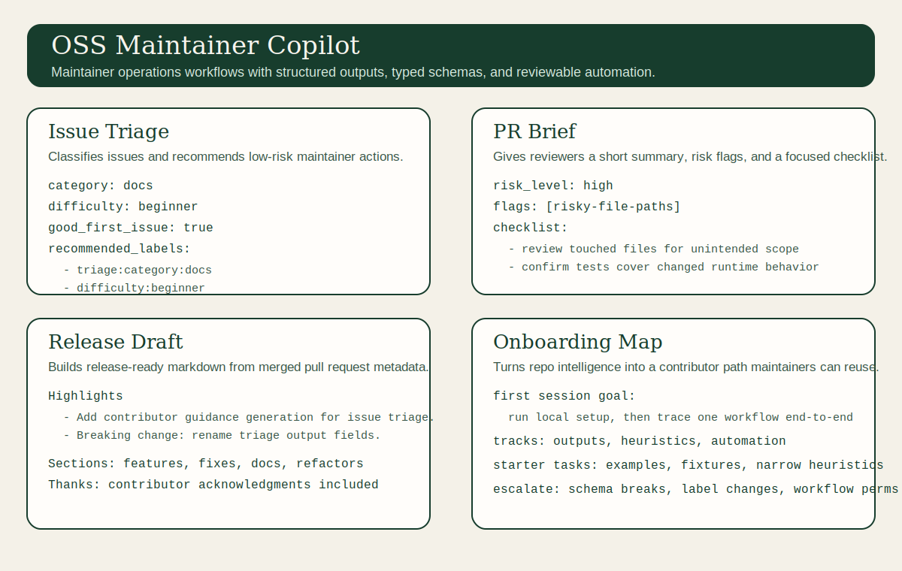

# OSS Maintainer Copilot

OSS Maintainer Copilot is a maintainer operations toolkit for GitHub repositories. It helps maintainers reduce repeated work in issue triage, PR review preparation, release drafting, and contributor onboarding decisions through typed schemas, deterministic logic, and GitHub Actions workflows.

This project is intentionally not "another chatbot for repos." The current focus is structured outputs that can be reviewed, tested, and plugged into repository automation with minimal hidden behavior.



The current milestone includes:

- repository scaffolding for an open-source Python project
- shared Pydantic schemas for GitHub payloads and automation outputs
- an issue triage agent with structured reasoning
- a dedicated good-first-issue classifier for safer onboarding recommendations
- a pull request summarizer with reviewer-focused output
- a release notes generator that produces draft-ready markdown and data quality notes
- an initial repository intelligence workflow for contributor onboarding and repo understanding
- a contributor onboarding map built on top of repository intelligence
- checked-in reusable skills for core maintainer workflows
- baseline OSS trust files for licensing, security reporting, CI, and community health
- CLI entrypoints for issue triage, PR summaries, release notes, repository intelligence, and onboarding maps
- pytest fixtures and unit tests
- GitHub Actions workflows for CI, issue triage, PR summaries, and release drafts

## Problem

Maintainers spend repeated effort on the same operational tasks:

- classifying and routing incoming issues
- deciding whether an issue is ready for a first-time contributor
- preparing reviewers with concise PR context
- assembling release notes from merged work
- explaining how repository structure maps to maintainer workflows

Most automation in this space is either repo-specific, opaque, or too tightly coupled. OSS Maintainer Copilot aims to keep the core small, typed, and inspectable so maintainers can adapt it to their own repositories without adopting a full SaaS product.

## Positioning

OSS Maintainer Copilot is best understood as a maintainer operations toolkit:

- issue triage
- PR review preparation
- release drafting
- contributor onboarding signals
- structured repository intelligence over time

That framing fits the current implementation and leaves room for future modules such as repository intelligence summaries and onboarding maps without changing the repository identity.

## Architecture

```text
src/oss_maintainer_copilot/
  agents/      Issue triage, onboarding, repo intelligence, PR summary, and release note agents
  github/      GitHub payload readers and API-facing wrappers
  prompts/     Task-specific prompt templates for future LLM-backed flows
  schemas/     Shared Pydantic models for inputs and outputs
tests/
  fixtures/    Sample GitHub issue, PR, and release payloads
skills/        Reusable maintainer workflow definitions and validation guidance
.github/workflows/
  ci.yml
  issue-triage.yml
  pr-summary.yml
  release-notes.yml
```

The current implementation favors deterministic heuristics so outputs stay stable and testable. Each automated recommendation includes inspectable reasoning that downstream tooling can consume.

## Why Maintainers Can Trust It

- deterministic heuristics with structured reasoning instead of opaque one-line summaries
- typed Pydantic schemas for every maintainer-facing workflow
- machine-readable JSON and markdown outputs for both humans and automation
- reviewable GitHub Actions with explicit permission scopes
- fixture-driven tests plus baseline CI on pushes and pull requests

## Current Workflows

### Issue Triage

The issue triage agent accepts an issue title, body, labels, and optional repository metadata. It produces:

- category
- difficulty
- good first issue boolean
- confidence
- missing context fields
- structured reasoning
- recommended automation labels

The separate good-first-issue agent builds on top of the triage result and applies stricter onboarding rules before recommending that a maintainer label the issue for newcomers.

### PR Review Briefs

The PR summarizer accepts a PR title, description, changed file paths, and commit messages. It produces:

- a short summary for status updates
- a technical summary oriented toward reviewers
- a structured risk assessment
- changed area detection
- reviewer focus guidance
- input warnings for noisy or underspecified PRs
- a reviewer checklist
- a release note snippet

It currently includes focused heuristics for docs-only PRs, risky workflow or runtime changes, explicit breaking changes, and broad multi-area pull requests that need staged review.

### Release Drafts

The release notes generator accepts merged PR metadata across a version range and produces:

- a release title
- release highlights
- grouped markdown sections for features, fixes, documentation, and refactors
- a dedicated breaking changes section
- data quality notes for incomplete or duplicated metadata
- contributor acknowledgments

The rendered markdown is designed to be pasted directly into a GitHub release draft with minimal cleanup, while still being honest about sparse metadata.

### Repository Intelligence

The repository intelligence agent accepts a normalized repository profile and produces:

- repository summary
- maintainer summary
- repository shape
- maintainer workflows
- local setup steps
- major areas explained
- key entry paths
- documentation surfaces
- workflow surfaces
- contributor starting points
- contributor checklist

This gives the project a first structured onboarding layer that future maintainer and contributor workflows can build on top of.

### Onboarding Maps

The onboarding map workflow builds on repository intelligence and produces:

- first-session goal
- setup checkpoints
- repository reading order
- contributor tracks
- starter tasks
- maintainer escalation notes

This turns repo understanding into a contributor path that maintainers can point newcomers toward instead of rewriting the same onboarding guidance repeatedly. The map now adapts to repository shape so docs-heavy and automation-heavy projects can suggest different first moves.

## Examples

The repository includes checked-in example inputs and outputs so evaluators can understand the workflows quickly:

- [Issue triage example](./examples/issue-triage/output.md)
- [PR brief example](./examples/pr-brief/output.md)
- [Release draft example](./examples/release-draft/output.md)
- [Repository intelligence example](./examples/repo-intel/output.md)
- [Onboarding map example](./examples/onboarding-map/output.md)
- [Examples overview](./examples/README.md)

These examples are backed by fixture data and include both markdown and JSON artifacts.

## Reusable Skills

The repository also includes checked-in maintainer workflow skills under [`skills/`](./skills/):

- `triage-issue`
- `prepare-pr-review`
- `draft-release-notes`
- `onboard-contributor`

These definitions document required inputs, workflow steps, output contracts, and validation paths so the workflows can stay reusable across CLI use, GitHub Actions, and future agent surfaces.

## Near-Term Direction

The current `v0.2` work strengthens OSS Maintainer Copilot as a maintainer workspace rather than just a set of isolated heuristics. The major tracks are:

- a deeper shared repository intelligence layer that understands repository structure and setup files
- contributor onboarding maps that adapt to repository shape
- triage internals split into signal, scoring, and rendering layers for safer extension
- broader PR review support for changed areas, noisy payloads, and staged review focus
- stronger release inputs with data quality notes and safer draft-generation behavior before a new tag exists
- workflow contract tests, example regression coverage, and reusable skill definitions

See [ROADMAP.md](./ROADMAP.md) for the concrete milestone plan.
For the issue-ready `v0.2` execution breakdown, see [docs/v0.2-maintainer-workspace-plan.md](./docs/v0.2-maintainer-workspace-plan.md).

## Getting Started

```bash
python -m venv .venv
. .venv/Scripts/activate
python -m pip install --upgrade pip
python -m pip install -e .[dev]
pytest
```

Run issue triage against a GitHub issue payload or issue event payload:

```bash
omc triage-issue --input tests/fixtures/issues/simple_docs_issue.json
```

Run PR summarization against a normalized PR payload or GitHub PR event payload:

```bash
omc summarize-pr --input tests/fixtures/pulls/pr_event_payload.json
```

Generate release notes from merged PR metadata:

```bash
omc generate-release-notes --input tests/fixtures/releases/release_window_mixed.json
```

Inspect repository structure and contributor starting points:

```bash
omc repo-intel --input tests/fixtures/repos/repo_intel_python_toolkit.json
```

Generate a contributor onboarding map:

```bash
omc onboarding-map --input tests/fixtures/repos/repo_intel_python_toolkit.json
```

Write machine-readable and markdown output:

```bash
omc triage-issue \
  --input tests/fixtures/issues/simple_docs_issue.json \
  --output triage.json \
  --markdown triage.md
```

```bash
omc summarize-pr \
  --input tests/fixtures/pulls/sample_pr.json \
  --output pr-summary.json \
  --markdown pr-summary.md
```

```bash
omc generate-release-notes \
  --input tests/fixtures/releases/release_window_mixed.json \
  --output release-notes.json \
  --markdown release-notes.md
```

```bash
omc onboarding-map \
  --input tests/fixtures/repos/repo_intel_python_toolkit.json \
  --output onboarding-map.json \
  --markdown onboarding-map.md
```

## GitHub Actions

The included [issue-triage workflow](./.github/workflows/issue-triage.yml) runs on opened, edited, and reopened issues. It:

1. installs the package
2. runs the triage CLI against the GitHub event payload
3. creates missing automation labels if needed
4. applies recommended labels
5. posts or updates a triage comment with structured guidance

The included [pr-summary workflow](./.github/workflows/pr-summary.yml) runs on pull request activity. It collects changed files and commit subjects, runs the PR summarizer, and posts or updates a summary comment on the PR.

The included [release-notes workflow](./.github/workflows/release-notes.yml) is triggered manually with a previous and current version tag. It gathers merged pull requests across that range, generates polished markdown, and creates or updates a draft GitHub release.

## Project Hygiene

- [LICENSE](./LICENSE): MIT license for open-source reuse
- [SECURITY.md](./SECURITY.md): coordinated disclosure and support expectations
- [CI workflow](./.github/workflows/ci.yml): runs Ruff and pytest on push and pull request
- [CODE_OF_CONDUCT.md](./CODE_OF_CONDUCT.md): shared behavior expectations and reporting guidance
- [Issue templates](./.github/ISSUE_TEMPLATE/bug_report.md): structured intake for bugs, features, and docs or onboarding work
- [Pull request template](./.github/pull_request_template.md): review-ready change summaries aligned with repository standards

## Roadmap

The project roadmap keeps the submitted repository identity intact while expanding the product around maintainer workflows.

See [ROADMAP.md](./ROADMAP.md) for the planned sequence.
